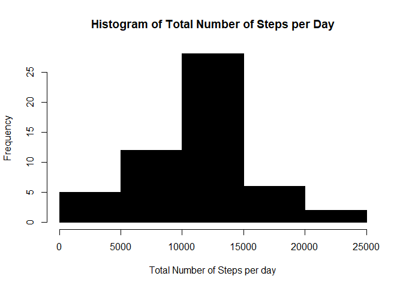
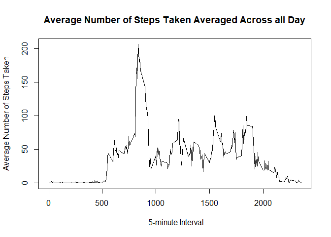
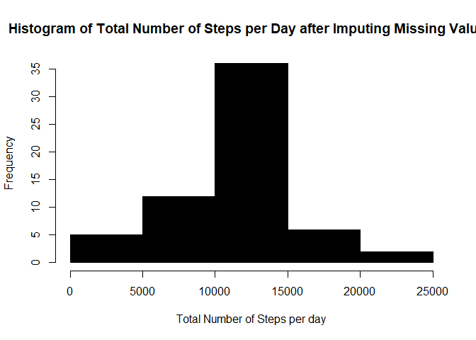
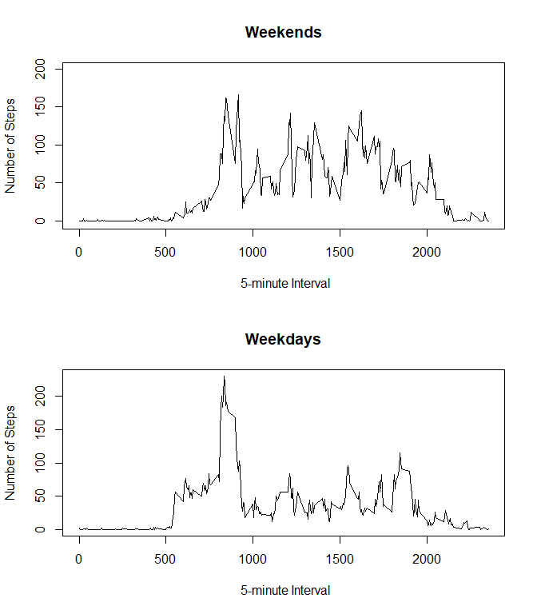

## Loading and preprocessing the data


```r
library(ggplot2)
library(zoo)
```

```
## 
## Attaching package: 'zoo'
```

```
## The following objects are masked from 'package:base':
## 
##     as.Date, as.Date.numeric
```

```r
fileUrl<-"https://d396qusza40orc.cloudfront.net/repdata%2Fdata%2Factivity.zip"
if(!file.exists("repdata_data_activity.zip")){
  download.file(fileUrl,"repdata_data_activity.zip")
}
if(!file.exists("activity.csv")){
  unzip("repdata_data_activity.zip")
}
activity <- read.csv("activity.csv")
activity$date <- as.Date(activity$date, "%Y-%m-%d")
```

## What is mean total number of steps taken per day?

```r
total <- aggregate(steps~date, activity, sum)
hist(total$steps, main="Histogram of Total Number of Steps per Day", 
     xlab="Total Number of Steps per day", col = "black")
```

<!-- -->

```r
summary(total$steps)
```

```
##    Min. 1st Qu.  Median    Mean 3rd Qu.    Max. 
##      41    8841   10765   10766   13294   21194
```
  
In the month of October and November, the **average steps** taken each day is **10766**, which is close to the **median number** of steps **10765**.  

## What is the average daily activity pattern?

```r
average<- aggregate(steps~interval, activity, mean)
with(average, plot(interval, steps, xlab = " 5-minute Interval", ylab = "Average Number of Steps Taken", type = "l"))
title(main="Average Number of Steps Taken Averaged Across all Day")
```

<!-- -->

```r
with(average, subset(average, steps == max(steps)))
```

```
##     interval    steps
## 104      835 206.1698
```
  
From table above, on average across all the days in the dataset, the **interval 835** contains the maximum number of steps of **206**. 
  
  
## Imputing missing values
  
  1. Calculate and report the total number of missing values in the dataset (i.e. the total number of rows with NAs)

```r
sum(is.na(activity$steps))
```

```
## [1] 2304
```

```r
mean(is.na(activity$steps))
```

```
## [1] 0.1311475
```
As the table above shows, the total number of missing values in the dataset is **2304**, around **11.1%** of the total observation data.  
  
  2. If we use the mean for that 5-minute interval to fill in all of the missing values in the dataset, we recreate a dataset with all the missing values filled in and make a histogram of the total number of steps taken each day. The output is shown as below:
  

```r
new_activity<- activity
new_activity$new_steps<- with(new_activity, na.aggregate(steps, by = interval))
new_activity <- new_activity[,2:4]
new_total <- aggregate(new_steps ~ date, new_activity, sum)
hist(new_total$new_steps, main="Histogram of Total Number of Steps per Day after Imputing Missing Values", 
     xlab="Total Number of Steps per day", col = "black")
```

<!-- -->
  
  3. Calculate and report the mean and median total number of steps taken per day. Do these values differ from the estimates from the first part of the assignment?

```r
summary(new_total$new_steps)
```

```
##    Min. 1st Qu.  Median    Mean 3rd Qu.    Max. 
##      41    9819   10766   10766   12811   21194
```
  
  As shown in the table above, the mean and median total number of steps taken per day both are **10766**. The average number of steps taken per day doesn't change after the missing value filled in with the mean of interval value. 
  
  4. What is the impact of imputing missing data on the estimates of the total daily number of steps?

```r
subset(new_total, !(new_total$date %in% total$date))
```

```
##          date new_steps
## 1  2012-10-01  10766.19
## 8  2012-10-08  10766.19
## 32 2012-11-01  10766.19
## 35 2012-11-04  10766.19
## 40 2012-11-09  10766.19
## 41 2012-11-10  10766.19
## 45 2012-11-14  10766.19
## 61 2012-11-30  10766.19
```
  
  As shown above, there are **8** days originally don't have steps count and now filled in with estimated total daily number of steps of **10776.19**.

## Are there differences in activity patterns between weekdays and weekends?
  

```r
new_activity$date <- weekdays(new_activity$date)
wk <- c("Saturday", "Sunday")
new_activity$days <- factor(new_activity$date %in% wk, labels = c("Weekday", "Weekend"))
new_average <- aggregate(new_steps~interval + days, new_activity, mean)
par(mfrow = c(2,1))
with(subset(new_average, days=="Weekend"), 
     plot(interval, new_steps, ylim = c(-2, 200),
          xlab = " 5-minute Interval", ylab = "Number of Steps", 
          main = "Weekends", type = "l"))
with(subset(new_average, days=="Weekday"), 
     plot(interval, new_steps, 
          xlab = " 5-minute Interval", ylab = "Number of Steps", 
          main = "Weekdays", type = "l"))
```

<!-- -->
  
  As shown in the figures above, the object is both very active in the morning during weekends and weekdays. He/she walks a bit more in the morning during weekdays than weekends. But he/she slows down and walks less during weekdays than weekends.
  
